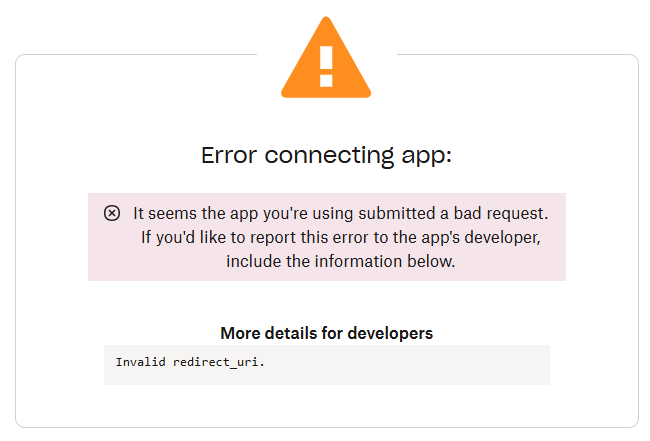

# Troubleshooting: Invalid `redirect_uri` Error

When you click **Allow Dropbox Access** in ERPNext, you may see this error:



This indicates the OAuth **redirect_uri** sent by ERPNext doesn’t exactly match what Dropbox expects. Follow these steps to resolve it.

---

## 1. Enter the Backend Container

1. On your host machine, list running containers:
   ```bash
   docker ps
   ```

2. Identify the **backend** container name (e.g., `erpnext-backend-1`).
3. Open a shell inside it:

   ```bash
   docker exec -it <backend-container> bash
   ```

---

## 2. Update `site_config.json`

1. Change to your site’s folder:

   ```bash
   cd ~/frappe-bench/sites/<site_name>
   ```
2. Open **`site_config.json`** in an editor and add below the existing `db_name` and `encryption_key` entries:

   ```json
   {
     "db_name": "YOUR_DB_NAME",
     "encryption_key": "YOUR_ENCRYPTION_KEY",
     "host_name": "<your-domain>",
     "force_https": true
   }
   ```
3. Save and exit the editor.

---

## 3. Set the Root URL in Frappe

From within the **`frappe-bench`** directory inside the container, run:

```bash
bench set-url-root <your-domain> https://<your-domain>
```

This ensures Frappe builds all links (including OAuth callbacks) with `https://`.

---

## 4. Clear Cache & Restart Bench

1. Clear the site cache:

   ```bash
   bench --site <your-domain> clear-cache
   ```
2. Restart all Bench services:

   ```bash
   bench restart
   ```

---

## 5. Restart Docker Services

Exit the container (`exit`) and on your host:

```bash
docker compose --project-name erpnext-one -f ~/gitops/erpnext-one.yaml down
docker compose --project-name erpnext-one -f ~/gitops/erpnext-one.yaml up -d
```

*Alternatively, use `docker compose restart` for a quicker reload.*

---

## 6. Verify the Fix

1. Return to:

   ```
   https://<your-domain>/app/dropbox-settings
   ```
2. Click **Allow Dropbox Access** again.
3. You should now complete the OAuth flow successfully without the `Invalid redirect_uri` error.

---

*Ensure `<your-domain>` is replaced everywhere with your actual ERPNext host (e.g., `erp.motionway.tv`).*
*Last updated: July 2025*

```
::contentReference[oaicite:0]{index=0}
```
